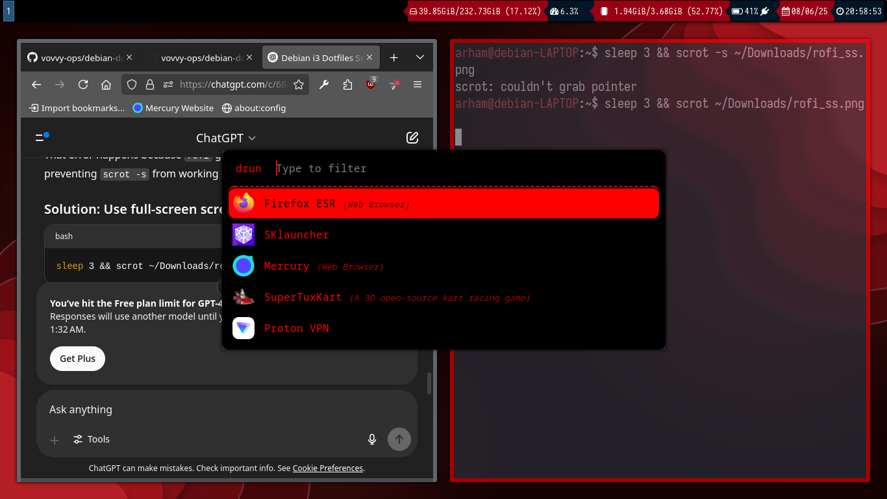

# Debian i3 Dotfiles

A clean and minimal i3 window manager setup on Debian with a red and black aesthetic.

## Overview

- **WM**: i3  
- **Compositor**: picom (for transparency and shadows)  
- **Bar**: bumblebee-status (modular and lightweight)  
- **Launcher**: rofi with a custom red & black theme  

## Theme

- **Color Scheme**: Red accents on a dark/black background  
- **Rofi**: Styled launcher and dmenu replacement  
- **i3**: Simple tiling with efficient keybindings  
- **Picom**: Smooth fading and subtle transparency  

## Screenshots

  
*Red & black themed rofi launcher*

  
*Custom Debian wallpaper used*

## Notes

These dotfiles are tailored for a fast, minimal experience with a bold visual theme.
It may look like it is using 2GB ram but it is not - that is because I am running servers...it should only use 400MB(Tested on 4GB ddr3 ram) and 2% CPU
